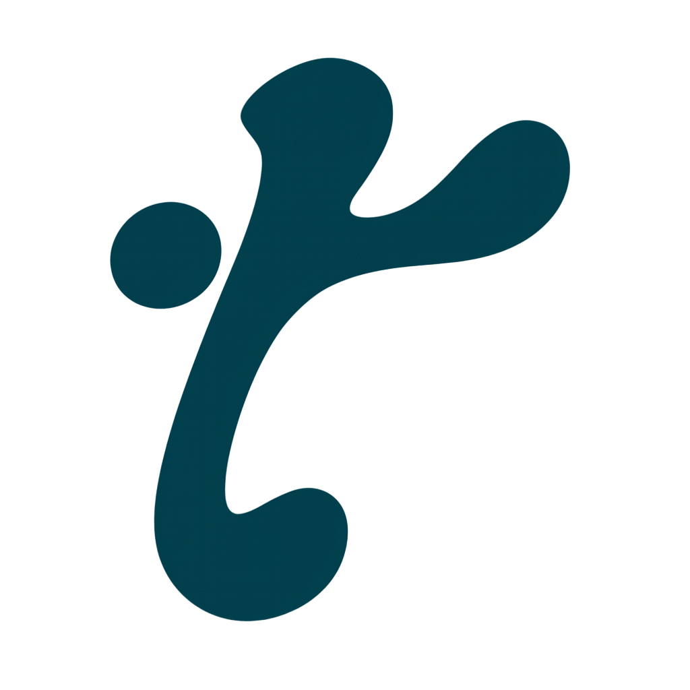

# TeamUP <a href="https://team-up-one-pink.vercel.app" target="_blank">  </a>

Welcome to **TeamUP**. <br>
A modern collaboration and events platform built to connect users, developers, companies, events, and opportunities in one interactive experience.

## Live Preview

The project is currently under deployment, and the first public preview page is live:

🔗 **[TeamUP Preview](https://team-up-one-pink.vercel.app)**

## Overview

**TeamUP** is a React-based platform designed to make collaboration, events, and opportunities easier to discover and access.

The platform includes multiple user flows such as:

- Clients
- Developers
- Companies
- Admins

It also includes interactive features like authentication, event discovery, profile management, quiz-based ranking, notifications, map-based event browsing, and an AI chatbot experience.

## Tech Stack

| Technology | Usage |
| ---------- | ----- |
| **React** | Frontend user interface |
| **Vite** | Development server and build tool |
| **Tailwind CSS** | Styling and responsive design |
| **React Router** | Client-side routing |
| **Framer Motion** | Animations and UI transitions |
| **Supabase** | Chat memory and backend storage |
| **n8n** | Chatbot workflow automation |
| **Vercel** | Deployment and public preview hosting |

## Project Structure

```bash
src/
├── assets/              # Images, logos, icons, and static assets
├── components/          # Reusable UI components
├── pages/               # Application pages
│   ├── public/          # Public pages such as DeploymentPage
│   └── auth/            # Authentication-related pages
├── routes/              # Main application routing
├── hooks/               # Custom React hooks
├── context/             # Global state and providers
├── utils/               # Helper functions and utilities
└── styles/              # Global styles if available
